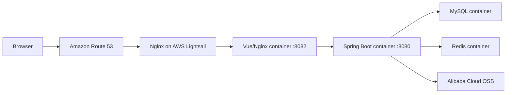

# Sky Take-Out

Sky Take-Out is a full-stack restaurant management and food ordering learning project. The repository uses a monorepo to manage a Spring Boot backend, a Vue 2 admin dashboard, and a uni-app WeChat Mini Program.

**Live admin demo:** [skytakeout.yangmingzhe.com](https://skytakeout.yangmingzhe.com)

## Main Features

- Employee authentication and restaurant administration
- Category, dish, and set-meal management
- Order processing and store-status management
- Redis-backed application data and MySQL persistence
- Image uploads through Alibaba Cloud OSS
- Containerized production deployment with automated CI/CD

The Mini Program source remains in the repository, while the current public deployment focuses on the admin dashboard and backend services.

## Technology Stack

### Application

- Java and Spring Boot
- MyBatis and Maven
- Vue 2
- MySQL 8
- Redis 7
- Alibaba Cloud OSS
- uni-app

### Deployment

- Docker and Docker Compose
- Nginx
- GitHub Actions
- GitHub Container Registry (GHCR)
- AWS Lightsail
- Amazon Route 53
- Let's Encrypt and Certbot

## Production Architecture



The four Docker Compose services are `frontend`, `backend`, `mysql`, and `redis`. Only the frontend is bound to the Lightsail instance's loopback interface; the other services communicate through a private Docker network.

## CI/CD

Every push to the `main` branch runs two CI jobs in parallel:

1. Build the backend Docker image.
2. Build the frontend Docker image.
3. Publish both images to GHCR with the Git commit SHA and `latest` tags.
4. Start the deployment workflow only after CI succeeds.
5. Connect to Lightsail through SSH and pull the exact images built from that commit.
6. Update the frontend and backend containers with Docker Compose.
7. Verify the public HTTPS website.

MySQL and Redis data are stored in named Docker volumes, so container replacement does not remove the application data.

## Project Structure

```text
sky-take-out/
├── .github/workflows/   CI and deployment workflows
├── deploy/              Backend, frontend, and Nginx build files
├── docs/sql/            Database initialization script
├── sky-common/          Shared backend module
├── sky-pojo/            Entities, DTOs, and VOs
├── sky-server/          Spring Boot service
├── sky-admin-vue/       Vue 2 admin dashboard
├── sky-miniprogram/     uni-app WeChat Mini Program
└── compose.yaml         Four-service container configuration
```

## Local Development

### Prerequisites

- JDK 17 (the project targets Java 8 bytecode)
- Maven 3.9+
- MySQL
- Redis
- Node.js 16.20.2
- WeChat DevTools and HBuilderX only when working with the Mini Program

The local startup order is:

```text
MySQL -> Redis -> Java backend -> Vue admin dashboard -> WeChat Mini Program
```

### 1. Configure the Database and External Services

Copy the configuration template:

```bash
cp sky-server/src/main/resources/application-dev.example.yml \
   sky-server/src/main/resources/application-dev.yml
```

Add your local MySQL, Redis, OSS, and WeChat settings to `application-dev.yml`. This file is ignored by Git, so real credentials are not committed.

The database name is `sky_take_out`. Initialize an empty local database with:

```bash
/usr/local/mysql/bin/mysql -u root -p < docs/sql/sky.sql
```

The SQL script recreates the project tables. Back up existing data before running it against a populated database.

### 2. Start the Backend

From the project root, run:

```bash
mvn -pl sky-server -am install -Dmaven.test.skip=true
mvn -pl sky-server spring-boot:run
```

After `Started SkyApplication` appears, verify the backend:

```bash
curl http://localhost:8080/user/shop/status
```

### 3. Start the Admin Dashboard

In a new terminal, run:

```bash
cd sky-admin-vue
source ~/.nvm/nvm.sh
nvm use
npm install --legacy-peer-deps
npm run serve
```

Open [http://localhost:8888](http://localhost:8888). The learning-project credentials are `admin` / `123456`.

Do not run `npm audit fix --force`. Forced dependency upgrades may prevent this legacy Vue 2 project from starting.

### 4. Start the WeChat Mini Program

Open `sky-miniprogram` with HBuilderX and run it in WeChat DevTools. Before connecting it to the local backend, change `baseUrl` in `sky-miniprogram/utils/env.js` to an address accessible from the Mini Program.

The simulator can use `http://localhost:8080`. A physical device requires the computer's LAN address or a public HTTPS address.

## Docker Deployment

The root `compose.yaml` reads production secrets from an ignored `.env` file. It expects the following variables:

```text
MYSQL_ROOT_PASSWORD
MYSQL_PASSWORD
REDIS_PASSWORD
JWT_ADMIN_SECRET
JWT_USER_SECRET
SKY_ALIOSS_ENDPOINT
SKY_ALIOSS_ACCESS_KEY_ID
SKY_ALIOSS_ACCESS_KEY_SECRET
SKY_ALIOSS_BUCKET_NAME
```

Do not commit the real `.env` file. After configuring it, start the stack with:

```bash
docker compose up -d --build
```

Check the containers with:

```bash
docker compose ps
```

## Stopping the Services

For locally started development processes, press `Control + C`. For the Docker Compose stack, run:

```bash
docker compose down
```
